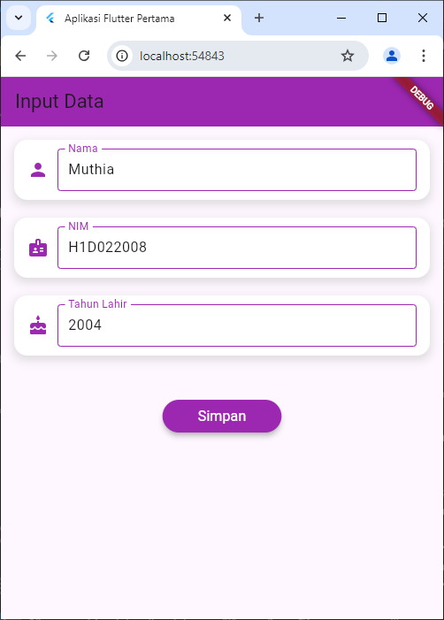
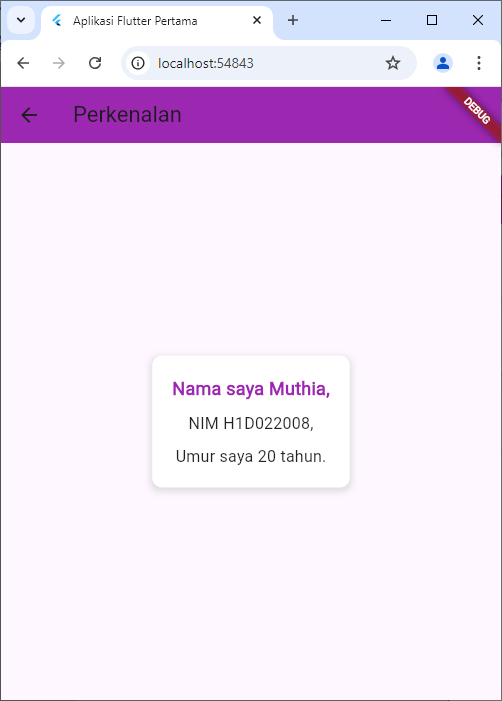

# Tugas Pertemuan 2

Nama : Muthia Khanza

NIM : H1D022008

Shift Baru: C

## Penjelasan

Proses passing data dari form menuju tampilan adalah sebagi berikut:

1. Input Data pada Form (FormData Widget):

   - Kelas `FormData` menggunakan tiga controller yaitu `_namaController`, `_nimController`,dan `_tahunController` untuk menangani input dari pengguna. Setiap controller dihubungkan dengan widget `TextField` untuk menangkap data seperti nama, nim, dan tahun lahir.
   - Saat tombol "Simpan" diklik oleh pengguna, event handler `onPressed` berperan, yang mengambil data dari masing-masing controller.

2. Selanjutnya navigasi ke tampilan berikutnya:

   - Setelah mendapatkan data dari controller, menggunakan `Navigator.of(context).push()` untuk berpindah ke layar baru. Passing data ke widget berikutnya (`TampilData`) dengan cara memanfaatkannya sebagai argumen dalam konstruktor.
   - Data yang dipassing adalah variabel nama, nim, dan tahun lahir, yang dikirim melalui parameter nama, nim, dan tahun lahir, pada widget `TampilData`.

3. TampilData Widget:
   - Widget `TampilData` menerima data melalui konstruktor, dengan properti `final String nama`, `final String nim`, dan `final int tahun`.
   - Properti-properti ini digunakan untuk menampilkan informasi di layar. Nilai `umur` dihitung dengan mengurangi tahun lahir dari tahun sekarang, dan hasilnya ditampilkan bersama data lainnya dalam widget `Text`.

## Screenshot

Contoh :

